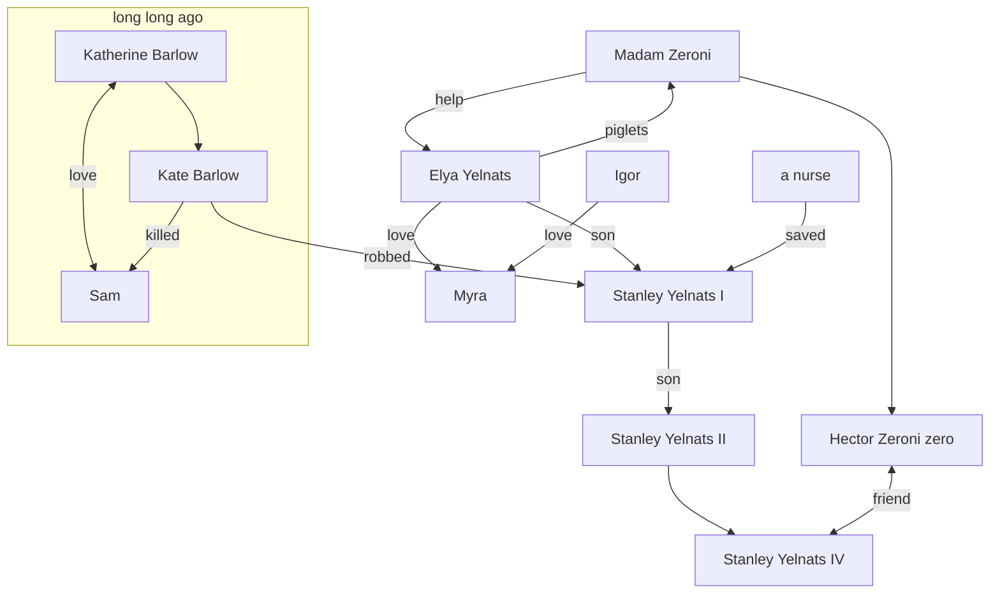
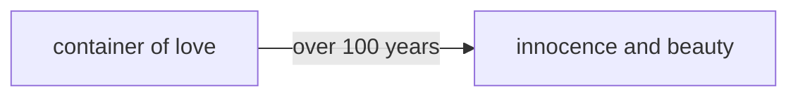

# Holes

---

# Table of contents

<Toc v-click minDepth="1" maxDepth="2"></Toc>

---
layout: center
---

# Introduction

   

- Holes was truly groundbreaking. --CARL HIAASEN(NY 
Times bestselling author):

- You'll remember Holes forever. --E.LockHART(NY Times bestselling author)

---

---
level: 1
layout: center
---

# Flashback

<v-clicks>

1. Onions
2. Yelnats carried Zeroni up the hill.
3.  Mary Lou(the donkey & the ship)
4. Girl Scout

</v-clicks>
---
layout: center
level: 1
---

# Language

## 'Holes'

- witness growth of Stanley
- treasure spot & abyss of greed

 

## Names

- 'Zeros': children's evaluation and portrait of themselves and others
- 'Stanley Yelnats': part of the theme

 

## 'Onion'

---
level: 1
layout: center
---

# Roles & Theme 

---
level: 2
layout: center
---

# Theme 1: Friendship

*true friendship transcends barriers*

- Teaching literacy in exchange for digging holes
- Risking life to rescue Zero
- Mutual care and sacrifice during the exile
- Taking Zero to freedom 

---
level: 2
layout: center
---

# Theme 2: Self-remodeling

*Reshape, renew and reborn*

- Once an overweight boy suffering from bullying and teases
- Building up muscle and resilience through digging holes
- Demonstrating commitment by taking the blame for stealing sunflower seeds

---
level: 2
layout: center
---

# Theme 3: Denstiny vs Choice

## Stanley Yelnats - From Curse to Control

- succumb to the family curse ?
- challenge it and strive for redemption !

 
 

## Zero - From Zero to Hero

- often overlooked and underestimated?
- help Stanley whcih lay the foundation for the friendship!
- bring the turing point of the story

---
layout: center
---

# Influence

- Our world and childhood with ambivalences 
- What a happy ending means to children
- Adults’ shadow from the perspective of races

---
class: text-center
layout: center
---

# Thanks!