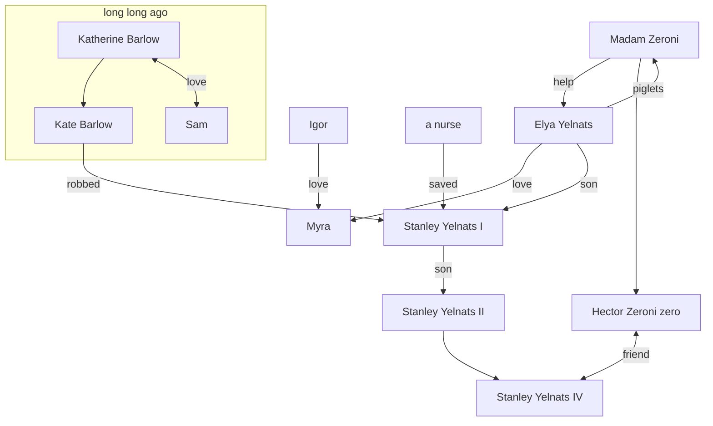
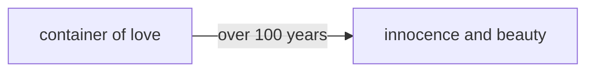

# Holes

---

# Table of contents

<Toc v-click minDepth="1" maxDepth="2"></Toc>

---
layout: center
---

# Introduction

   

- Holes was truly groundbreaking. --CARL HIAASEN(NY 
Times bestselling author)

- You'll remember Holes forever. --E.LockHART(NY Times bestselling author)

---

---
layout: center
level: 1
---

# Language

## 'Holes'

- witness growth of Stanley
- treasure spot & abyss of greed

 

## Names

- 'Zeros': children's evaluation and portrait of themselves and others
- 'Stanley Yelnats': part of the theme

 

## 'Onion'

---
level: 1
layout: center
---

# Flashback

<v-clicks>

1. Onions
2. Yelnats carried Zeroni up the hill.
3.  Mary Lou(the donkey & the ship)
4. Girl Scout

</v-clicks>

---
level: 1
layout: center
---

# Roles & Theme 

---
level: 2
layout: center
---

# Theme 1: Friendship

*true friendship transcends barriers*

<v-clicks>

- Teaching literacy in exchange for digging holes
- Risking life to rescue Zero
- Mutual care and sacrifice during the exile
- Taking Zero to freedom 

</v-clicks>

---
level: 2
layout: center
---

# Theme 2: Self-remodeling

*Reshape, renew and reborn*

<v-clicks>

- Once an overweight boy suffering from bullying and teases
- Building up muscle and resilience through digging holes
- Demonstrating commitment by taking the blame for stealing sunflower seeds

</v-clicks>
---
level: 2
layout: center
---

# Theme 3: Denstiny vs Choice

## Stanley Yelnats - From Curse to Control

<v-clicks>

- succumb to the family curse ?
- challenge it and strive for redemption !

</v-clicks>
 
 

## Zero - From Zero to Hero

<v-clicks>

- often overlooked and underestimated?
- help Stanley which lay the foundation for the friendship!
- bring the turing point of the story

</v-clicks>

---
layout: center
---

# Influence

<v-clicks>

- Our world and childhood with ambivalences 
- What a happy ending means to children
- Adults’ shadow from the perspective of races

</v-clicks>
---
layout: center
---

# Reference

- Sachar, Louis. Holes. New York, Farrar, Straus And Giroux, 20 Aug. 1998.
- Trites, Roberta Seelinger. “The Harry Potter Novels as a Test Case for Adolescent Literature.” Style, vol. 35, no. 3, 2001, pp. 472–85.
- Enciso, Patricia, et al. “Children’s Literature: Standing in the Shadow of Adults.” Reading Research Quarterly, vol. 45, no. 2, 6 Apr. 2010, pp. 252–263, https://doi.org/10.1598/rrq.45.2.5.
- Nodelman, Perry. The Hidden Adult : Defining Children’s Literature. Baltimore, Johns Hopkins University Press, 2008.

---
class: text-center
layout: center
---

# Thanks!